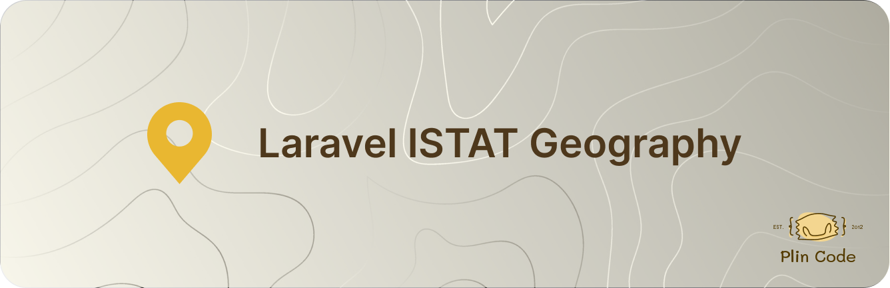

# Laravel ISTAT Geography

<p align="center">
  
</p>

A Laravel package for importing and managing Italian geographical data from ISTAT.

## Features

- 🇮🇹 Import Italian regions, provinces, and municipalities from ISTAT
- 🔄 Incremental updates: add new records, update changes, soft-delete removed ones
- 📊 Daily CSV caching to avoid unnecessary requests
- 🔗 Eloquent models with hierarchical relationships
- ⚡ Artisan commands for easy data import and synchronization
- 🔧 Fully configurable via configuration file
- 🆔 UUID primary keys and soft deletes support
- 🧪 Comprehensive test suite with mocked HTTP requests

## Requirements

- PHP 8.3+
- Laravel 11.0+ or 12.0+
- league/csv 9.0+
- guzzlehttp/guzzle 7.0+

## Installation

```bash
composer require plin-code/laravel-istat-geography
```

## Quick Start

1. **Install the package:**

```bash
composer require plin-code/laravel-istat-geography
```

2. **Publish the configuration:**

```bash
php artisan vendor:publish --provider="PlinCode\IstatGeography\IstatGeographyServiceProvider"
```

3. **Run migrations:**

```bash
php artisan migrate
```

4. **Import the data:**

```bash
php artisan geography:import
```

That's it! You now have all Italian geographical data in your database.

## Commands

### `geography:import`

Performs a full import of all geographical data from ISTAT. Use this for the initial data load.

```bash
php artisan geography:import
```

### `geography:update`

Incrementally synchronizes your database with the latest ISTAT data. It compares the current ISTAT CSV against your existing records and applies only the differences: new records are added, changed records are updated, and records no longer present in ISTAT are soft-deleted.

```bash
php artisan geography:update
```

#### Options

| Option | Description |
|---|---|
| `--dry-run` | Simulate the update without making any database changes. Shows what would be added, modified, or deleted. |
| `--force` | Continue execution even if non-critical errors occur (errors are logged as warnings). |

#### Verbosity Levels

| Flag | Output |
|---|---|
| *(none)* | Final summary only (e.g. `3 added, 1 modified, 0 deleted`) |
| `-v` | Download progress, list of new/modified/suppressed records, progress bar |
| `-vv` | Field-level change details (e.g. `name: Old Name → New Name`) |
| `-vvv` | Debug output with timing information for each operation |

#### Examples

```bash
# Preview changes without applying them
php artisan geography:update --dry-run

# Run with verbose output
php artisan geography:update -v

# Run with full debug output
php artisan geography:update -vvv

# Force continue on non-critical errors
php artisan geography:update --force
```

All database operations are wrapped in a transaction. If any error occurs (and `--force` is not set), all changes are automatically rolled back.

## Configuration

Publish the configuration file:

```bash
php artisan vendor:publish --provider="PlinCode\IstatGeography\IstatGeographyServiceProvider"
```

The `config/istat-geography.php` file allows you to customize:

- **Table names**: Customize the database table names
- **Model classes**: Use your own model classes by extending the base ones
- **CSV URL**: Change the ISTAT data source URL
- **Temporary file name**: Customize the cache file name

### Example Configuration

```php
return [
    'tables' => [
        'regions' => 'my_regions',
        'provinces' => 'my_provinces',
        'municipalities' => 'my_municipalities',
    ],
    'models' => [
        'region' => \App\Models\Region::class,
        'province' => \App\Models\Province::class,
        'municipality' => \App\Models\Municipality::class,
    ],
    'import' => [
        'csv_url' => 'https://custom-url.com/data.csv',
        'temp_filename' => 'my_istat_data.csv',
    ],
];
```

## Models

The package provides three Eloquent models:

### Region

```php
use PlinCode\IstatGeography\Models\Geography\Region;

$region = Region::where('name', 'Piemonte')->first();
$provinces = $region->provinces;
```

### Province

```php
use PlinCode\IstatGeography\Models\Geography\Province;

$province = Province::where('code', 'TO')->first();
$municipalities = $province->municipalities;
$region = $province->region;
```

### Municipality

```php
use PlinCode\IstatGeography\Models\Geography\Municipality;

$municipality = Municipality::where('name', 'Torino')->first();
$province = $municipality->province;
```

### ISTAT Fields

Each model exposes a static `istatFields()` method that returns the list of fields managed by ISTAT data. These are the fields that the `geography:update` command is allowed to overwrite. Any additional fields you add to your extended models will not be touched during updates.

```php
Region::istatFields();       // ['name', 'istat_code']
Province::istatFields();     // ['name', 'code', 'istat_code', 'region_id']
Municipality::istatFields(); // ['name', 'istat_code', 'province_id']
```

### Extending Models

If you want to use the package models in your main project, you can extend them:

```php
// app/Models/Region.php
namespace App\Models;

use PlinCode\IstatGeography\Models\Geography\Region as BaseRegion;

class Region extends BaseRegion
{
    // Add your project-specific logic here
    public function customMethod()
    {
        return $this->provinces()->count();
    }
}
```

```php
// app/Models/Province.php
namespace App\Models;

use PlinCode\IstatGeography\Models\Geography\Province as BaseProvince;

class Province extends BaseProvince
{
    // Add your project-specific logic here
}
```

```php
// app/Models/Municipality.php
namespace App\Models;

use PlinCode\IstatGeography\Models\Geography\Municipality as BaseMunicipality;

class Municipality extends BaseMunicipality
{
    // Add your project-specific logic here
}
```

Remember to update the `models` section in the configuration file to point to your custom classes.

## Database Structure

### Regions

- `id` (UUID, primary key)
- `name` (string)
- `istat_code` (string, unique)
- `created_at`, `updated_at`, `deleted_at`

### Provinces

- `id` (UUID, primary key)
- `region_id` (UUID, foreign key)
- `name` (string)
- `code` (string, unique)
- `istat_code` (string, unique)
- `created_at`, `updated_at`, `deleted_at`

### Municipalities

- `id` (UUID, primary key)
- `province_id` (UUID, foreign key)
- `name` (string)
- `istat_code` (string, unique)
- `created_at`, `updated_at`, `deleted_at`

## Relationships

- `Region` → `hasMany` → `Province`
- `Province` → `belongsTo` → `Region`
- `Province` → `hasMany` → `Municipality`
- `Municipality` → `belongsTo` → `Province`

## Replacing Existing Command

If you already have a `geography:import` command in your project, you can replace it with the package's command:

```php
// In app/Console/Kernel.php or in your existing command
Artisan::command('geography:import', function () {
    $this->info('Starting geographical data import...');

    try {
        $count = \PlinCode\IstatGeography\Facades\IstatGeography::import();
        $this->info("Import completed successfully! Imported {$count} municipalities.");
    } catch (\Exception $e) {
        $this->error('Error during import: ' . $e->getMessage());
    }
})->purpose('Import regions, provinces and municipalities from ISTAT');
```

## Testing

Run the test suite:

```bash
composer test
```

The package includes:

- ✅ Unit tests for models and relationships
- ✅ Feature tests for the import service
- ✅ Feature tests for the update command and services
- ✅ Mocked HTTP requests (no external dependencies)
- ✅ PHPStan static analysis
- ✅ Pest PHP testing framework

### Test Coverage

- Models and their relationships
- Import service with CSV processing
- Compare service for detecting changes
- Update service for applying changes
- Artisan command functionality (import and update)
- Configuration handling

## Contributing

1. Fork the project
2. Create a feature branch (`git checkout -b feature/amazing-feature`)
3. Commit your changes (`git commit -m 'Add some amazing feature'`)
4. Push to the branch (`git push origin feature/amazing-feature`)
5. Open a Pull Request

## License

The MIT License (MIT). Please see [License File](LICENSE.md) for more information.
